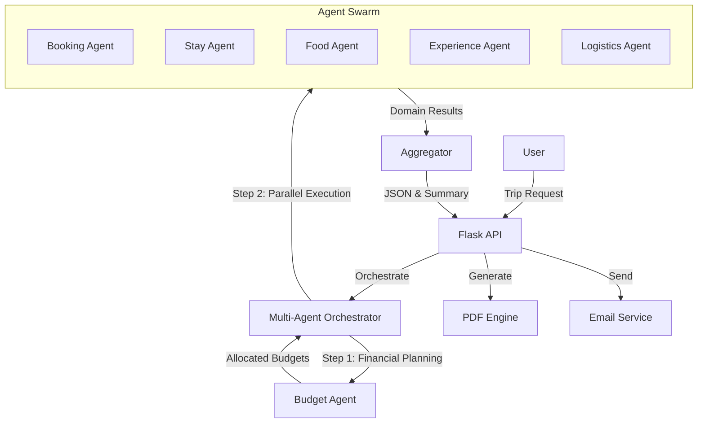
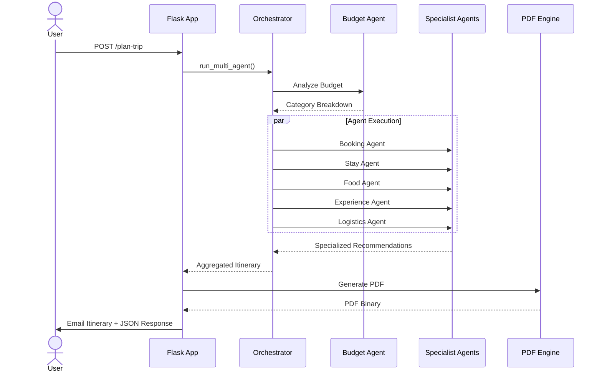

# 🌍 TripTacticx – Intelligent Multi-Agent Travel Planner


> **Orchestrating AI agents to curate hyper-personalized travel experiences.**

TripTacticx is a next-generation travel planning platform that leverages a **Multi-Agent System (MAS)** architecture. Unlike traditional planners that rely on static databases, TripTacticx deploys specialized AI agents to dynamically fetch, analyze, and synthesize real-time travel data—creating bespoke itineraries tailored to your specific budget, preferences, and group dynamics.

---

## 🚀 Key Features

*   **🤖 Multi-Agent Orchestration:** A swarm of specialized agents (Booking, Stay, Food, Experience, Logistics) working in parallel to build your perfect trip.
*   **📋 PDF Itinerary Generation:** Automated, professionally formatted PDF export using `ReportLab`, emailed directly to users.
*   **💬 AI Assistant 'Compass':** An integrated LLM-powered chat assistant (powered by Llama 3 via Groq) for real-time travel queries.
*   **🔐 Secure Authentication:** Robust user management with `Flask-Login` and hashed passwords.
*   **📱 Responsive UI:** A modern, mobile-friendly frontend designed for seamless user experience.
*   **📊 Admin Dashboard:** Comprehensive controls for managing users and trips.

---

## 🏗️ System Architecture

TripTacticx is built on a modular Service-Oriented Architecture (SOA).

### The Core: Multi-Agent System
The brain of TripTacticx is located in `backend/agents/`. Each agent is an independent module responsible for a specific domain:

| Agent | Responsibility | Technology/Method |
| :--- | :--- | :--- |
| **Booking Agent** | Flight/Train aggregation & pricing | API / Scraping / AI Analysis |
| **Stay Agent** | Hotel & Airbnb recommendations | Location-based filtering |
| **Food Agent** | Culinary experiences & dining | Sentiment analysis of reviews |
| **Experience Agent** | Activity curation | Interest-matching algorithms |
| **Logistics Agent** | Route optimization | Graph-based pathfinding |
| **Budget Agent** | Cost estimation & optimization | Financial modeling |


### 🧩 Architectural Diagrams

#### System Logic Flow


#### Execution Sequence


### Technology Stack

*   **Backend:** Python 3, Flask, SQLAlchemy, Gunicorn
*   **AI/LLM:** Groq API (Llama-3.3-70b-versatile)
*   **Database:** SQLite (Dev) / PostgreSQL (Prod ready)
*   **Frontend:** Vanilla HTML5, CSS3, JavaScript (Fetch API)
*   **Utilities:** ReportLab (PDF), SMTP (Email), Python-Dotenv


---

## 🛠️ Installation & Setup

Follow these steps to deploy TripTacticx locally.

### Prerequisites
*   Python 3.9+
*   pip
*   git

### 1. Clone the Repository
```bash
git clone https://github.com/Luqmaan29/TripTacticx.git
cd TripTacticx
```

### 2. Set Up Virtual Environment
```bash
python3 -m venv venv
source venv/bin/activate  # On Windows: venv\Scripts\activate
```

### 3. Install Dependencies
```bash
pip install -r requirements.txt
```

### 4. Configure Environment Variables
Create a `.env` file in the `backend/` directory:
```bash
touch backend/.env
```
Add the following configuration keys:
```env
SECRET_KEY=your_super_secret_key
GROQ_API_KEY=gsk_your_groq_api_key
EMAIL_ADDRESS=your_email@gmail.com
EMAIL_PASSWORD=your_app_password
ADMIN_EMAIL=admin@example.com
```

### 5. Run the Application
Start the Flask server:
```bash
cd backend
python app.py
```
 The server will start at `http://localhost:5001`.

---

## 🔌 API Documentation

TripTacticx exposes a RESTful API. Here are the core endpoints:

### Authentication
*   `POST /signup` - Register a new user.
*   `POST /login` - Authenticate user & start session.
*   `GET /check-auth` - Verify session status.

### Core Logic
*   `POST /plan-trip` - **Main Endpoint.** Triggers the Multi-Agent System.
    *   **Body:** `{ destination, start_date, budget, group_size, ... }`
*   `POST /api/chat` - Interact with the 'Compass' AI assistant.
*   `POST /api/recommend` - Get a quick single-destination recommendation.

### User Data
*   `GET /api/my-trips` - Retrieve history of generated itineraries.

---

## 📂 Project Structure

```
Trip-Tacticx/
├── backend/
│   ├── agents/          # Individual AI Agent modules
│   ├── app.py           # Main Flask application entry point
│   ├── travel_agent.py  # Agent orchestration logic
│   ├── models.py        # Database models (User, Trip)
│   └── .env             # Environment secrets (GitIgnored)
├── frontend/
│   ├── index.html       # Single Page Application entry
│   ├── css/             # Stylesheets
│   └── js/              # Frontend logic
├── Dockerfile           # Containerization setup
└── requirements.txt     # Python dependencies
```

---

## 🤝 Contributing

Contributions are welcome! Please fork the repository and submit a Pull Request.

1.  Fork the Project
2.  Create your Feature Branch (`git checkout -b feature/AmazingFeature`)
3.  Commit your Changes (`git commit -m 'Add some AmazingFeature'`)
4.  Push to the Branch (`git push origin feature/AmazingFeature`)
5.  Open a Pull Request

---

## 📜 License

Distributed under the MIT License. See `LICENSE` for more information.

---

<p align="center">
  Built with ❤️ by the TripTacticx Team
</p>
